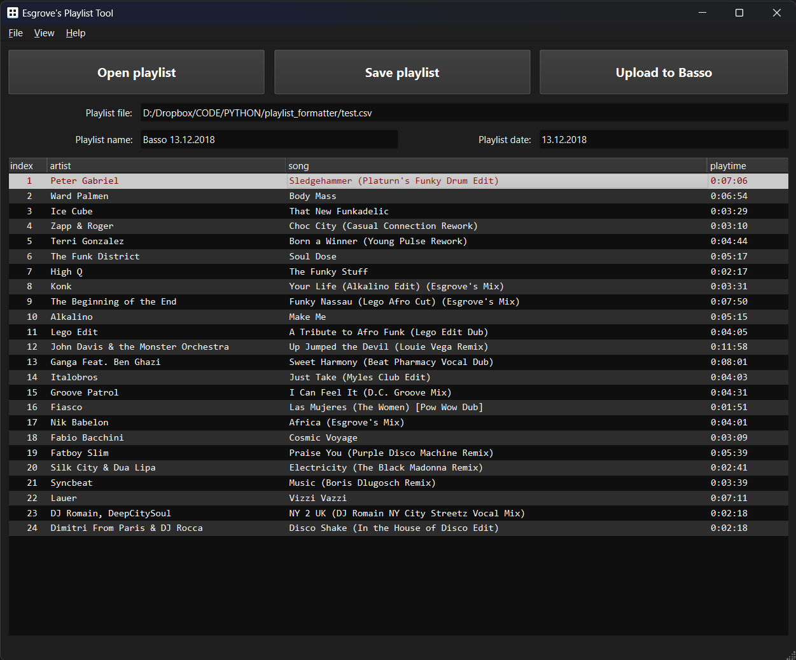
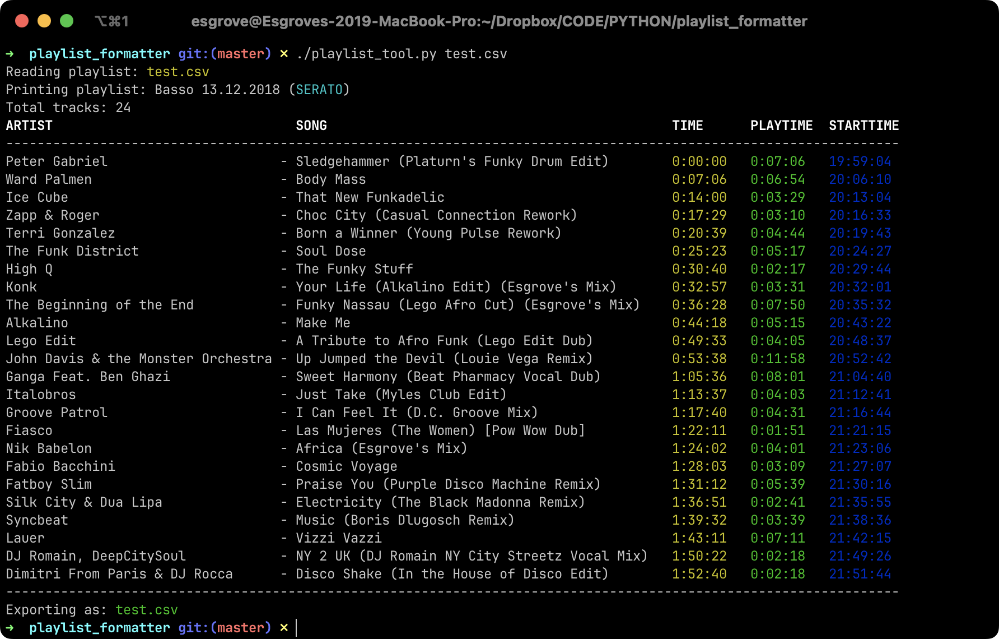

# Playlist Tool

Helper tool for auto-formatting DJ playlists exported from DJ software.
Originally created for my own and fellow Bassoradio DJs use back when I was doing a radio show at Bassoradio.
The original version was done with Python and has both a PyQt6 GUI and CLI version.

Used to process a raw playlist file exported from a DJ software:
text is formatted and title cased properly and play times are calculated from timestamps,
and then exported back to a file.
The formatted playlist will work well for example with Mixcloud.

Since then, I have added a new Rust implementation. See below for the details.

## Python version

Python version supports:

- csv playlists exported from Serato DJ Pro
- txt playlists exported from Rekordbox

### Python dependencies

- Python 3.11+ required (primarily due to use of `Self` type hinting)
- Poetry

```shell
poetry install
```

### Looks like





## Rust version

New Rust CLI version supports:

- csv and txt playlists exported from Serato DJ Pro
- txt playlists exported from Rekordbox

> **Note**: Uses Finnish time and date formatting, so might not work fully in case timestamps are in a different format

### Rust crates

- [clap](https://github.com/clap-rs/clap) for CLI arguments
- [chrono](https://github.com/chronotope/chrono) for date and time handling
- [anyhow](https://github.com/dtolnay/anyhow) for nice error handling and messages
- [csv](https://github.com/BurntSushi/rust-csv) for csv reading and writing
- some others for logging etc...

### Build

Using helper script, which will move the release executable to the repo root:

```shell
./build.sh
```

Manually:

```shell
# debug
cargo build
cargo run
# release
cargo build --release
cargo run --release
```

Cargo will output the executable to either

```shell
target/debug/playfmt
target/release/playfmt
```

depending on which build profile is used.

### Install

You can install a release binary locally using [cargo install](https://doc.rust-lang.org/cargo/commands/cargo-install.html).
Note that you need to specify the path to the directory containing [Cargo.toml](/Cargo.toml):

```shell
cargo install --path .
```

After this you should have `playfmt` available globally.

**Note:** Cargo will put the binary under `$HOME/.cargo/bin` by default,
which should be added to PATH so the binaries installed through Cargo will be found.

### Format Rust code

Using [rustfmt](https://github.com/rust-lang/rustfmt)

```shell
cargo fmt
```

### Lint Rust code

Using [Clippy](https://github.com/rust-lang/rust-clippy)

```shell
cargo clippy
cargo clippy --fix
```

### Update Rust dependencies

```shell
cargo update
```
